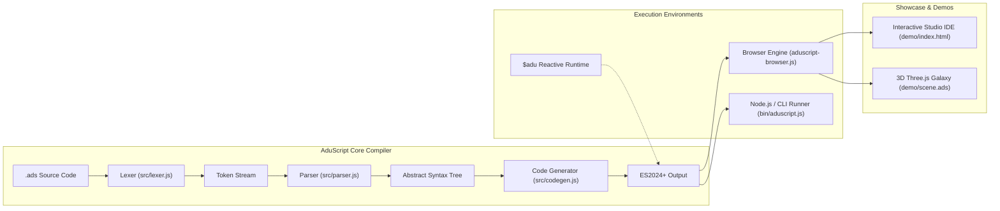

# 🪐 AduScript (`.ads`)
### A Clean, Highly Expressive Web Programming Language Compiling to ECMAScript 2024+


[](https://opensource.org/licenses/MIT)
[](https://tc39.es)
[](#)
[](./tests)
[](./quickstart.html)

**AduScript** is a modern, expressive programming language designed from first principles for building complex, interactive web applications and 3D experiences with zero boilerplate, first-class reactive state primitives, pipeline transformation operators, pattern matching, and seamless two-way JavaScript/HTML/CSS interoperability.

---

## ⚡ Zero-Node.js Quickstart (Works in Any Browser Out-of-the-Box)

Anyone can use AduScript with HTML and CSS **without Node.js, npm, or any build tools**! Just open [`quickstart.html`](./quickstart.html) or drop `<script src="dist/aduscript-browser.js">` into any HTML file:

```html
<!DOCTYPE html>
<html>
<head>
  <!-- Load Standalone AduScript Engine -->
  <script src="https://cdn.jsdelivr.net/gh/HarisAbidX/AduScript/dist/aduscript-browser.js"></script>
</head>
<body>
  <div id="app"></div>

  <!-- Write Pure AduScript with HTML and CSS directly -->
  <script type="text/aduscript">
    state count = 0

    fn renderApp() {
      return $adu.html`
        <div style="font-family:sans-serif;padding:32px;background:#181818;color:#fff;border-radius:16px;">
          ${$adu.logo(40)}
          <h2>Clicks: ${count.value}</h2>
          <button onclick=${() -> count.value += 1}>+ Increment</button>
        </div>
      `
    }

    $adu.mount("#app", renderApp)
  </script>
</body>
</html>
```

---

## 🎨 IDE Support & Official SVG Logo

* **Official File Icons & Syntax Highlighting:** AduScript includes official VS Code & IDE extension support in [`extensions/vscode-aduscript/`](./extensions/vscode-aduscript) providing `.ads` file icon rendering with the official AduScript SVG logo, TextMate syntax highlighting grammar, and language snippets.
* **In-App SVG Logo Helper:** Display the official vector logo anywhere in `.ads` templates with `$adu.logo(size)`!

---

## 🌟 Key Features

* **🛡️ Immutable by Default:** Declarations use `let` for immutable bindings (compiled to `const`) and `mut` for explicitly mutable variables (compiled to `let`).
* **🔀 First-Class Pipeline Operator (`|>`)**: Clean left-to-right functional data transformations:
  ```aduscript
  let total = data |> .filter(isValid) |> .map(extract) |> applyTax(_, 0.08) |> formatCurrency()
  ```
* **🎯 Expressive Pattern Matching (`match ... with`)**: Clean, robust pattern matching replacing verbose `switch` and fragile `if-else` trees:
  ```aduscript
  let badge = match status with {
    "online"  => "#10b981",
    "busy"    => "#f59e0b",
    { role: "admin" } => "#ec4899",
    1..10     => "#38bdf8",
    _         => "#6b7280"
  }
  ```
* **⚡ Built-in Reactive Primitives (`state`, `watch`, `effect`)**:
  Fine-grained reactive state signals that automatically track dependencies and dispatch reactions on mutation:
  ```aduscript
  state count = 0
  effect { document.title = f"Clicks: {count.value}" }
  watch count => { console.log(f"New count: {count.value}") }
  ```
* **🌐 Zero-Boilerplate CDN / ESM Interop (`use`)**:
  Instantly pull CDN packages and standard ES modules into scope without configuration:
  ```aduscript
  use cdn:three as THREE
  use cdn:gsap as gsap
  use "https://cdn.jsdelivr.net/npm/canvas-confetti@1.9.3/+esm" as confetti
  ```
* **✨ Formatted String Interpolation:** `f"Hello {user.name}, your score is {score + 10}!"`
* **🚀 Auto-Returning Expression Functions:** `fn add(a, b) -> a + b`
* **📦 Zero Dependencies:** The entire compiler (Lexer, Parser, AST, Codegen, Runtime, In-Browser Engine) is self-contained with 0 third-party runtime dependencies.

---

## 🏗️ Compiler Architecture



---

## 🚀 Quick Start

### 1. In the Browser (Zero Build Step)

Include `dist/aduscript-browser.js` in your HTML page and write `.ads` code directly inside `<script type="text/aduscript">` or link external `.ads` files:

```html
<!DOCTYPE html>
<html>
<head>
  <script src="dist/aduscript-browser.js"></script>
</head>
<body>
  <!-- Inline AduScript -->
  <script type="text/aduscript">
    use cdn:three as THREE

    state speed = 1.0
    fn degToRad(deg) -> deg * (Math.PI / 180)

    let scene = new THREE.Scene()
    let camera = new THREE.PerspectiveCamera(75, window.innerWidth / window.innerHeight, 0.1, 1000)
    let renderer = new THREE.WebGLRenderer({ antialias: true })
    renderer.setSize(window.innerWidth, window.innerHeight)
    document.body.appendChild(renderer.domElement)

    let geometry = new THREE.TorusKnotGeometry(1.5, 0.4, 128, 32)
    let material = new THREE.MeshNormalMaterial()
    let mesh = new THREE.Mesh(geometry, material)
    scene.add(mesh)
    camera.position.z = 5

    fn animate() {
      requestAnimationFrame(animate)
      mesh.rotation.x += 0.01 * speed.value
      mesh.rotation.y += 0.02 * speed.value
      renderer.render(scene, camera)
    }
    animate()
  </script>

  <!-- Remote AduScript File -->
  <!-- <script type="text/aduscript" src="scene.ads"></script> -->
</body>
</html>
```

### 2. Command Line Interface (CLI)

```bash
# Compile .ads to standard JavaScript ES module
node bin/aduscript.js demo/scene.ads -o demo/scene.js

# Compile and immediately execute in Node.js
node bin/aduscript.js demo/pipeline_showcase.ads --run

# Inspect Abstract Syntax Tree (AST)
node bin/aduscript.js demo/reactive_ui.ads --ast

# Inspect Token Stream
node bin/aduscript.js demo/scene.ads --tokens
```

### 3. Programmatic Node.js / Module API

```javascript
import { compile, parse, tokenize, $adu } from 'aduscript';

const source = `
  state count = 0
  fn square(x) -> x * x
  let result = 5 |> square |> (x -> f"Result: {x}")
`;

const { code, ast } = compile(source);
console.log(code);
```

---

## 🎨 Interactive 3D Showcase & Live Studio IDE

AduScript includes a full-featured in-browser Studio IDE (`demo/index.html`) featuring:
* **Live 3D Three.js Galaxy Viewport** running `demo/scene.ads`
* **Real-time Transpilation & Code Editor** with hot reloading
* **Interactive AST Tree Inspector**
* **Token Stream Inspector**
* **Real-time Reactive HUD Controls** (Geometry selector, Wireframe toggle, Speed slider)

To launch the demo server locally:
```bash
npm run demo
```
Then open [http://localhost:3000/demo/index.html](http://localhost:3000/demo/index.html) in your browser.

---

## 🧪 Automated Test Suite

AduScript includes a comprehensive, zero-dependency unit and integration test suite covering the Lexer, Parser, Code Generator, and Reactive Runtime:

```bash
npm test
```

```
▶ Suite: Lexer & Tokenizer
  ✔ tokenizes keywords and immutable/mutable declarations
  ✔ tokenizes pipeline and arrow operators
  ✔ tokenizes range operator and optional chaining
  ✔ tokenizes formatted strings with interpolation f"..."
  ✔ tokenizes numbers in hex, binary, and floats
  ✔ reports descriptive syntax errors with line/column pointers

▶ Suite: AST Parser
  ✔ parses immutable let and mutable mut declarations
  ✔ parses reactive state declarations
  ✔ parses auto-returning single-expression functions
  ✔ parses pipeline operator chains
  ✔ parses pattern matching construct
  ✔ parses CDN use declarations
  ✔ parses watch and effect statements

▶ Suite: Code Generator (codegen.js)
  ✔ compiles let to const and mut to let
  ✔ compiles single-expression functions with return
  ✔ compiles pipeline expressions into nested function calls
  ✔ compiles pipeline placeholder expressions
  ✔ compiles method pipeline shorthand
  ✔ compiles use cdn statements to ESM imports
  ✔ compiles state, watch, and effect statements
  ✔ compiles pattern matching with $adu.match

▶ Suite: AduScript Runtime ($adu)
  ✔ reactive state updates subscribers when mutated
  ✔ reactive effect automatically tracks dependencies
  ✔ computed signals derive and update reactively
  ✔ nested object and array proxy mutations trigger reactivity
  ✔ evaluates pattern matching with literals, ranges, and wildcards
  ✔ pipe and range helpers function correctly

==================================================
Test Results: 27/27 Passed
✔ All test suites passed successfully!
```

---

## 📖 Language Tour & Comparison

| Feature | JavaScript (ES2024) | AduScript (`.ads`) |
| :--- | :--- | :--- |
| **Immutability** | `const x = 10; let y = 20;` | `let x = 10; mut y = 20;` |
| **Single-Expr Fn** | `const add = (a, b) => a + b;` | `fn add(a, b) -> a + b` |
| **Data Pipelines** | `fn3(fn2(fn1(data, arg1), arg2))` | `data \|> fn1(arg1) \|> fn2(arg2) \|> fn3()` |
| **Pattern Matching** | Verbose `switch` / nested `if-else` | `match val with { 1..10 => "small", { id } => id, _ => "other" }` |
| **CDN Import** | `import * as THREE from "https://esm.sh/three";` | `use cdn:three as THREE` |
| **Reactive State** | Requires external framework (React/Vue/Svelte) | Built-in `state count = 0`, `watch`, `effect` |
| **String Interpolation** | `` `Count: ${count}` `` | `f"Count: {count}"` |

For full formal specifications and EBNF grammar, see [SPECIFICATION.md](./SPECIFICATION.md).

---

## 📜 License

MIT License © 2026 Google DeepMind / Antigravity Engineering.
